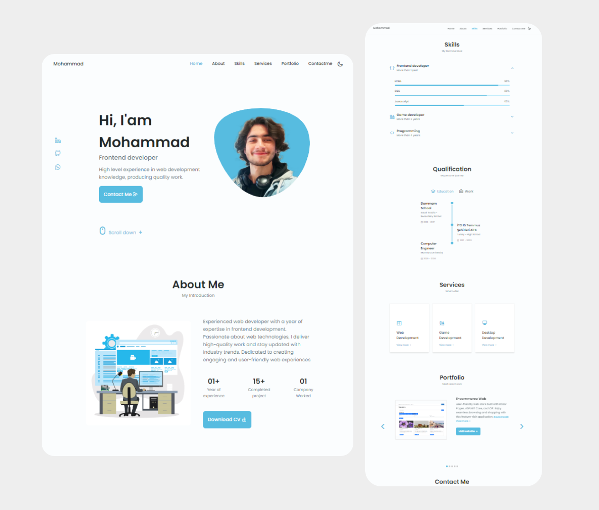

# Portfolio Website

Welcome to my portfolio website! This is where I showcase my projects, skills, and experiences as a frontend developer.

  

## Live Demo

Check out my portfolio website live at [https://mosalah-code.github.io/](https://mosalah-code.github.io/).

## Features

- Clean and modern design
- Responsive layout for optimal viewing on various devices
- Projects section highlighting my featured projects
- Skills section showcasing my technical expertise
- About Me section providing insights into my background and interests
- Contact section with a contact form for getting in touch

## Technologies Used

- HTML
- CSS
- JavaScript

## Deployment

This portfolio website is deployed using GitHub Pages and is accessible at [https://mosalah-code.github.io/](https://mosalah-code.github.io/).

## Development

To run the website locally, follow these steps:

1. Clone the repository: `git clone https://github.com/mosalah-code/mosalah-code.github.io.git`
2. Open the `index.html` file in your preferred web browser.

## Contact

Feel free to reach out to me through the contact form on my portfolio website or via email at [muhammed-salah@outlook.com](mailto:muhammed-salah@outlook.com).
